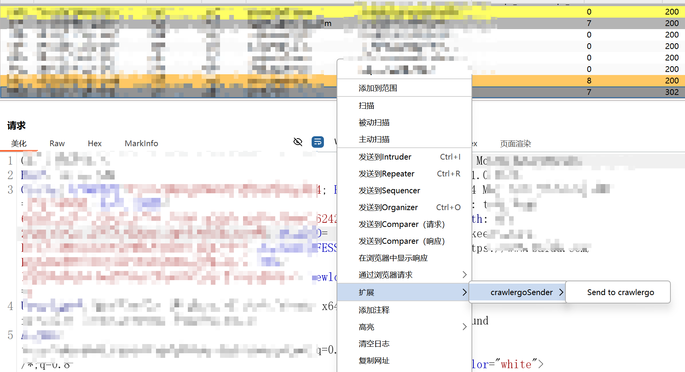
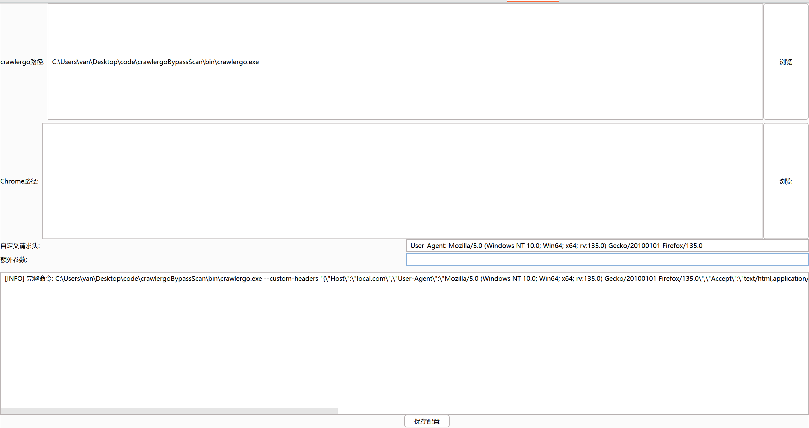

# crawlergoSender

> 所有代码均由AI生成

此插件实现了BurpSuite记录数据包--发送到crawlergo爬虫进行爬取链接--联动其他被动扫描器，仅为了节省中间复制header和cookies以及调用执行的时间以及补全手动点击联动被动扫描器缺乏动态爬虫覆盖而产生的插件。

在日志列表中右键发送到crawlergo运行爬虫，可以在配置页面加上`--push-to-proxy http://127.0.0.1:2222/`参数来联动被动扫描器，或者发送到BurpSuite中，再从BurpSuite中的上游代理发送到被动扫描器

UI依次为

- crawlergo主程序路径
- Chrome路径
- 自定义请求头
- 额外的参数，如`--push-to-proxy http://127.0.0.1:2222/`等
- 日志输出框，在BurpSuite.jar路径下会产生 crawlergo_log.txt 详细日志

